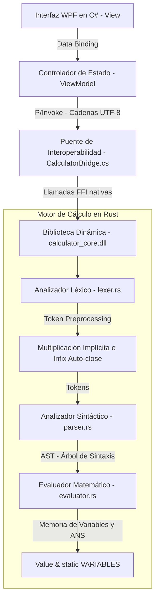

# Calculadora Rust (Rust + C# / WPF)


**Calculadora Rust** es una aplicación de alto rendimiento e interactiva que combina una interfaz de usuario moderna en **C# con WPF (Windows Presentation Foundation)** bajo el patrón **MVVM**, y un motor matemático ultrarrápido desarrollado en **Rust** (compilado como una biblioteca dinámica `.dll`).

Esta integración híbrida permite resolver operaciones aritméticas avanzadas, cálculo numérico, álgebra lineal con matrices, estadística descriptiva, regresiones, probabilidades, graficación de funciones en 2D en múltiples coordenadas y conversión de unidades físicas con latencia mínima y total precisión.

---

## 🏛️ Arquitectura del Sistema

La comunicación entre el frontend de C# y el motor nativo de Rust se realiza mediante interoperabilidad a través de **P/Invoke (Platform Invoke)** y **FFI (Foreign Function Interface)**:



### Flujo de Datos

1. **Frontend (C#)**: Recibe las entradas del usuario por botones o teclado. Valida la expresión en tiempo real y la envía a través del puente como puntero a una cadena codificada en UTF-8 (`IntPtr`).
2. **Puente FFI (C# <-> Rust)**: Declara los métodos importados de `calculator_core.dll`, realizando el formateo de los datos y asegurando la liberación de memoria en el heap nativo (`free_string_ffi`).
3. **Motor (Rust)**:
   - **Lexer**: Tokeniza la entrada. Aplica un preprocesador para inyectar operadores de multiplicación implícita (`5x` $\rightarrow$ `5 * x`) y balancear paréntesis abiertos al final de la expresión.
   - **Parser**: Valida las reglas de sintaxis y construye el **Árbol de Sintaxis Abstracta (AST)**.
   - **Evaluator**: Evalúa el AST recursivamente empleando un sistema dinámico de tipos (`Value`) y gestiona las variables de usuario.

---

## 🚀 Módulos Avanzados y Características Especiales

La Calculadora Rust cuenta con las siguientes capacidades matemáticas avanzadas:

### 1. Álgebra Lineal y Matrices

Soporta vectores y matrices directamente desde la entrada de texto utilizando la sintaxis estándar de corchetes delimitados por comas (columnas) y puntos y comas (filas).
- **Sintaxis**: `[1, 2; 3, 4]` (matriz 2x2) o `[1, 2, 3]` (vector fila de 3 elementos).
- **Operaciones**:
  - **Determinante (`det`)**: Calcula el determinante. Ejemplo: `det([1, 2; 3, 4])` $\rightarrow$ `-2`.
  - **Inversa (`inv`)**: Calcula la matriz inversa. Ejemplo: `inv([1, 2; 3, 4])` $\rightarrow$ `[-2, 1; 1.5, -0.5]`.
  - **Transpuesta (`transpose` / `trans`)**: Transpone filas y columnas. Ejemplo: `transpose([1, 2])` $\rightarrow$ `[1; 2]`.

### 2. Números Complejos

El evaluador tiene soporte integrado de forma nativa para números complejos representados como parte real e imaginaria.
- **Sintaxis**: `3 + 4i` o `1 - i`.
- **Operaciones**:
  - **Parte Real e Imaginaria (`re`, `im`)**: Obtiene los componentes. Ejemplo: `re(3+4i)` $\rightarrow$ `3`, `im(3+4i)` $\rightarrow$ `4`.
  - **Conjugado (`conj`)**: Calcula el conjugado. Ejemplo: `conj(3+4i)` $\rightarrow$ `3 - 4i`.
  - **Argumento (`arg`)**: Devuelve el ángulo de fase. Ejemplo: `arg(i)` $\rightarrow$ `1.57079633` (radianes).
  - **Polar (`polar`)**: Construye un complejo a partir de su módulo y argumento. Ejemplo: `polar(5, 0)` $\rightarrow$ `5`.

### 3. Análisis Numérico y Cálculo

Permite realizar cálculos del análisis matemático directamente en el motor:
- **Derivada Numérica (`deriv`)**: Calcula la derivada de una expresión en un punto evaluado.
  - *Sintaxis*: `deriv(expresión, variable, punto)` o implícito `deriv(expresión, punto)`.
  - *Ejemplo*: `deriv(x^2, x, 3)` $\rightarrow$ `6` (derivada de $x^2$ en $x=3$).
- **Integral Definida (`intg`)**: Calcula el área bajo la curva usando cuadratura numérica.
  - *Sintaxis*: `intg(expresión, variable, límite_inferior, límite_superior)` o implícito `intg(expresión, límite_inf, límite_sup)`.
  - *Ejemplo*: `intg(x^2, 0, 3)` $\rightarrow$ `9`.
- **Sumatoria (`sum`) y Productoria (`prod`)**: Ejecuta bucles de evaluación matemática para rangos definidos.
  - *Sintaxis*: `sum(expresión, índice, inicio, fin)` y `prod(expresión, índice, inicio, fin)`.
  - *Ejemplo*: `sum(i^2, i, 1, 4)` $\rightarrow$ `30`, `prod(i, i, 1, 5)` $\rightarrow$ `120`.

### 4. Estadística Descriptiva y Regresiones

Procesa arreglos y vectores de datos numéricos para calcular estimadores estadísticos y ajustar modelos de regresión mediante mínimos cuadrados:
- **Estadísticas Básicas**: `mean(vector)` (media), `median(vector)` (mediana), `var(vector)` (varianza muestral), `std(vector)` (desviación estándar).
- **Covarianza y Correlación**: `cov(vector1, vector2)` y `corr(vector1, vector2)`.
- **Regresión Lineal (`linreg`)**: Devuelve la pendiente, el intercepto, el coeficiente de correlación $r$ y el coeficiente de determinación $R^2$.
  - *Sintaxis*: `linreg(x_vector, y_vector)` $\rightarrow$ `[pendiente, intercepto, r, R²]`.
- **Regresión Polinómica (`polyreg`)**: Devuelve los coeficientes del polinomio ajustado de grado $n$.
  - *Sintaxis*: `polyreg(x_vector, y_vector, grado)`.

### 5. Probabilidad y Distribuciones

Permite el cálculo de densidades de probabilidad (PDF) e integrales acumuladas (CDF) para variables aleatorias continuas y discretas:
- **Distribución Normal**: `normpdf(x, media, std)` y `normcdf(x, media, std)` (los parámetros de media y desviación por defecto son 0 y 1).
- **Distribución Binomial**: PMF `binopdf(k, n, p)` y CDF `binocdf(k, n, p)`.
- **Distribución de Poisson**: PMF `poisspdf(k, lambda)` y CDF `poisscdf(k, lambda)`.
- **Generación Aleatoria (`rand`)**: `rand()` (0 a 1), `rand(max)` (0 a max), `rand(min, max)` (min a max).

### 6. Sistema de Almacenamiento de Variables de Memoria

* **Asignación directa**: Asigna y reutiliza variables en la memoria persistente del motor utilizando `=` (ej. `10 = A` o `B = 5`).
- **Variables permitidas**: Letras de la `A` a la `Z` y el carácter especial `θ` (utilizado para cálculos angulares y gráficos).
- **Último cálculo (`ans`)**: Almacena de manera automática el último resultado numérico exitoso y permite reutilizarlo escribiendo `ans`.

---

## 🎨 Modos de Visualización y Graficación 2D

El frontend en C# integra un plano cartesiano interactivo capaz de renderizar múltiples tipos de funciones y ecuaciones matemáticas con auto-escalado y rejillas inteligentes:

1. **Gráficos Rectangulares ($y = f(x)$)**: Graficación convencional.
2. **Gráficos Polares ($r = f(\theta)$)**: Convierte las coordenadas del radio $r$ evaluadas sobre $\theta$ (de $0$ a $2\pi$) en coordenadas rectangulares ($x = r\cos\theta, y = r\sin\theta$). Dibuja rosas, cardioides y espirales complejas.
3. **Gráficos Paramétricos ($x(t), y(t)$)**: Recibe expresiones delimitadas por comas (ej. `4 * cos(t), 4 * sin(t)`) y las evalúa sobre el parámetro temporal $t$.
4. **Ecuaciones en el eje Y ($x = f(y)$)**: Evalúa expresiones que dependen únicamente de la variable $y$ (ej. `y^2 - 3`) sobre el rango de visualización del eje Y, dibujando parábolas o curvas horizontales de manera fluida.

---

## ⚡ Mejoras Clave de Usabilidad (UX)

La aplicación resuelve de manera transparente inconsistencias lógicas de la interfaz gráfica y del parser de Rust:
- **Evaluación Unaria Inmediata**: Al presionar botones rápidos de operadores unarios (como `√x`, `x²`, `x³`, `1/x`, `10^x`, `2^x`, `fact`), la interfaz de C# detecta si hay texto en pantalla y lo envuelve (ej. `sqrt(5)`), calculando y mostrando el resultado final con opacidad completa en un solo clic. Si la pantalla está vacía, se aplica automáticamente sobre `ans`.
- **Multiplicación Implícita**: El motor de Rust inserta de forma transparente el operador de multiplicación `*` entre coeficientes y variables o funciones (ej. `5sqrt(9)` $\rightarrow$ `5 * sqrt(9)`, `(2+3)(4-1)` $\rightarrow$ `(2+3) * (4-1)`).
- **Autocompletado de Paréntesis**: Se balancean automáticamente al evaluar cualquier expresión que tenga paréntesis o corchetes abiertos pendientes de cerrar, previniendo errores de validación molestos para el usuario.
- **Bypass de RPN**: Las expresiones escritas en Notación Polaca Inversa son detectadas automáticamente por el motor y omiten el preprocesamiento de tokens, permitiendo una evaluación de pilas nativa sin interferencias.

---

## 📂 Estructura del Código Fuente

Para guiarte en el desarrollo e inspección del proyecto, los componentes fundamentales son:

- **[src/lib.rs](file:///c:/Users/hsm76/Documents/VS%20Pro/calculadora-rust/src/lib.rs):** Define la API pública FFI exportada a C#, la lógica del conversor de unidades y manejadores de seguridad `catch_unwind`.
- **[src/calculator/ast.rs](file:///c:/Users/hsm76/Documents/VS%20Pro/calculadora-rust/src/calculator/ast.rs):** Define las variantes del árbol AST del compilador (`AST::Num`, `AST::BinOp`, `AST::Func`, `AST::Matrix`, etc.).
- **[src/calculator/token.rs](file:///c:/Users/hsm76/Documents/VS%20Pro/calculadora-rust/src/calculator/token.rs):** Define el listado de componentes léxicos (Tokens) soportados por el motor.
- **[src/calculator/lexer.rs](file:///c:/Users/hsm76/Documents/VS%20Pro/calculadora-rust/src/calculator/lexer.rs):** Analizador léxico y preprocesador de tokens (multiplicación implícita y auto-close de paréntesis).
- **[src/calculator/parser.rs](file:///c:/Users/hsm76/Documents/VS%20Pro/calculadora-rust/src/calculator/parser.rs):** Analizador sintáctico que traduce los tokens en un AST validando la precedencia matemática.
- **[src/calculator/evaluator.rs](file:///c:/Users/hsm76/Documents/VS%20Pro/calculadora-rust/src/calculator/evaluator.rs):** Implementa el cálculo recursivo de los nodos del AST, la pila de RPN y el mapa de variables mutable.
- **[CalculatorGui/CalculatorBridge.cs](file:///c:/Users/hsm76/Documents/VS%20Pro/calculadora-rust/CalculatorGui/CalculatorBridge.cs):** Puente C# que realiza el marshalling de cadenas y llamadas nativas por P/Invoke.
- **[CalculatorGui/View/CalculatorView.xaml.cs](file:///c:/Users/hsm76/Documents/VS%20Pro/calculadora-rust/CalculatorGui/View/CalculatorView.xaml.cs):** Controla el comportamiento dinámico de los botones físicos, la visualización de datos y la interceptación de funciones unarias rápidas.
- **[CalculatorGui/ViewModel/CalculatorViewModel.cs](file:///c:/Users/hsm76/Documents/VS%20Pro/calculadora-rust/CalculatorGui/ViewModel/CalculatorViewModel.cs):** Controlador MVVM principal para cálculo de expresiones y validación reactiva en tiempo real.

---

## 🛠️ Guía de Compilación y Desarrollo

### Prerrequisitos

1. Tener [.NET SDK](https://dotnet.microsoft.com/download) (versión 8.0 o superior).
2. Tener instalado el compilador de [Rust y Cargo](https://www.rust-lang.org/tools/install).

### Paso 1: Compilar la biblioteca de Rust

En la raíz del proyecto, ejecuta:

```bash
cargo build --release
```

Esto generará la biblioteca dinámica `calculator_core.dll` en la carpeta `target/release/`.

### Paso 2: Compilar y Ejecutar la aplicación WPF

Puedes arrancar la calculadora directamente a través del SDK de .NET:

```bash
dotnet run --project CalculatorGui/CalculatorGui.csproj
```

El archivo de proyecto está configurado para copiar automáticamente la biblioteca DLL construida en Rust al directorio de salida correspondiente en Windows.

### Paso 3: Ejecutar Pruebas Automatizadas

Para verificar el correcto funcionamiento matemático del motor de cálculo en Rust, ejecuta:

```bash
cargo test
```

Esto correrá las **51 pruebas integradas** de operaciones algebraicas, álgebra lineal, números complejos, cálculo diferencial/integral y regresiones de datos.
